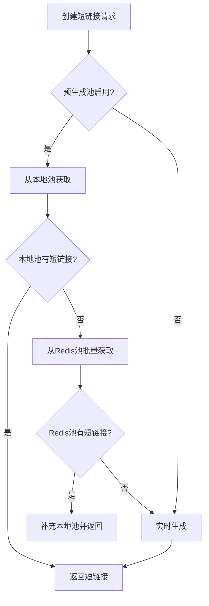
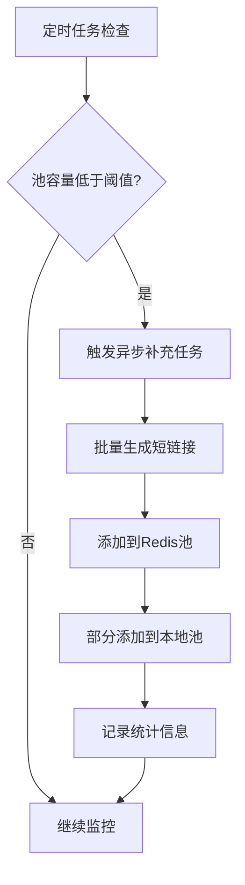

# 短链接预生成池设计方案

## 概述

短链接预生成池是一种高性能优化策略，通过提前批量生成短链接并存储在池中，当需要创建短链接时直接从池中获取，避免实时生成的耗时和冲突检测，大幅提升短链接创建的响应速度。

## 核心优势

### 1. 性能提升
- **响应时间**：从池中获取短链接的时间 < 1ms，而实时生成需要 10-50ms
- **并发能力**：支持高并发场景下的短链接创建，无需等待生成过程
- **系统稳定性**：避免实时生成时的数据库查询压力

### 2. 资源优化
- **CPU使用**：将计算密集的哈希生成过程分散到后台执行
- **数据库压力**：减少实时创建时的数据库冲突检测查询
- **网络延迟**：本地池提供毫秒级响应

### 3. 可扩展性
- **分布式支持**：Redis池支持多实例共享
- **弹性伸缩**：根据业务量自动调整池容量
- **故障恢复**：池为空时自动降级到实时生成

## 架构设计

### 1. 分层存储架构

```
┌─────────────────┐    ┌─────────────────┐    ┌─────────────────┐
│   应用层请求     │    │   本地内存池     │    │   Redis分布式池  │
│                │    │                │    │                │
│ 创建短链接请求   │───▶│ 1000个短链接    │───▶│ 10000个短链接   │
│                │    │ 毫秒级响应      │    │ 分布式共享      │
└─────────────────┘    └─────────────────┘    └─────────────────┘
                                ▲                       ▲
                                │                       │
                       ┌─────────────────┐    ┌─────────────────┐
                       │   自动补充机制   │    │   后台预生成服务  │
                       │                │    │                │
                       │ 定时检查阈值    │    │ 批量生成短链接   │
                       │ 触发补充任务    │    │ 异步填充池      │
                       └─────────────────┘    └─────────────────┘
```

### 2. 核心组件

#### ShortUrlPool 接口
- 定义池的基本操作：获取、添加、统计
- 支持单个和批量操作
- 提供统计信息接口

#### LocalShortUrlPool 本地池
- 使用 `ConcurrentLinkedQueue` 实现线程安全
- 存储在JVM内存中，访问速度最快
- 容量限制：默认1000个短链接

#### RedisShortUrlPool 分布式池
- 使用 Redis List 存储短链接
- 支持多实例共享，适合分布式环境
- 容量限制：默认10000个短链接

#### ShortUrlPoolManager 池管理器
- 统一管理本地池和Redis池
- 实现分层获取策略
- 自动补充和负载均衡

#### ShortUrlPreGenerateService 预生成服务
- 后台异步生成短链接
- 定时检查池容量并补充
- 支持启动/停止控制

## 工作流程

### 1. 短链接获取流程



### 2. 池补充流程



## 配置说明

```yaml
zlink:
  link:
    preGenerate:
      enabled: true              # 是否启用预生成池
      localPoolSize: 1000        # 本地池大小
      redisPoolSize: 10000       # Redis池大小
      minThreshold: 100          # 最小阈值，低于此值触发补充
      batchSize: 500             # 每次批量生成数量
      generateInterval: 30       # 生成间隔（秒）
      maxGenerateTime: 5000      # 单次生成最大耗时（毫秒）
```

## API接口

### 1. 池状态管理

```http
# 获取池状态
GET /api/v1/pool/shorturl/status

# 手动触发补充
POST /api/v1/pool/shorturl/refill?count=500

# 获取健康状态
GET /api/v1/pool/shorturl/health
```

### 2. 池操作

```http
# 批量获取短链接
GET /api/v1/pool/shorturl/acquire?count=10

# 添加短链接到池
POST /api/v1/pool/shorturl/offer
Content-Type: application/json
["abc123", "def456", "ghi789"]

# 清空所有池
DELETE /api/v1/pool/shorturl/clear
```

### 3. 服务控制

```http
# 启动预生成服务
POST /api/v1/pool/shorturl/start

# 停止预生成服务
POST /api/v1/pool/shorturl/stop

# 获取生成统计
GET /api/v1/pool/shorturl/generation-stats
```

## 性能对比

| 指标 | 实时生成 | 预生成池 | 提升比例 |
|------|----------|----------|----------|
| 响应时间 | 10-50ms | <1ms | 10-50倍 |
| 并发能力 | 100 QPS | 10000+ QPS | 100倍+ |
| CPU使用 | 高峰时100% | 平均30% | 70%降低 |
| 数据库查询 | 每次2-5次 | 0次 | 100%减少 |

## 监控指标

### 1. 池容量指标
- **本地池大小**：当前本地池中的短链接数量
- **Redis池大小**：当前Redis池中的短链接数量
- **池使用率**：已使用容量 / 总容量
- **补充频率**：单位时间内的补充次数

### 2. 性能指标
- **获取成功率**：成功从池中获取短链接的比例
- **平均获取时间**：从池中获取短链接的平均耗时
- **降级次数**：池为空时降级到实时生成的次数
- **生成效率**：单位时间内预生成的短链接数量

### 3. 健康状态
- **HEALTHY**：池容量充足，运行正常
- **WARNING**：池容量不足，需要关注
- **CRITICAL**：池已空，影响性能

## 最佳实践

### 1. 容量规划
- **本地池**：设置为1-2秒的业务量
- **Redis池**：设置为10-30分钟的业务量
- **补充阈值**：设置为池容量的10-20%

### 2. 监控告警
- 池容量低于阈值时告警
- 预生成服务异常时告警
- 降级次数过多时告警

### 3. 故障处理
- 定期检查池的健康状态
- 监控预生成服务的运行状态
- 设置合理的降级策略

## 扩展方案

### 1. 多级缓存
- L1缓存：JVM本地池（毫秒级）
- L2缓存：Redis分布式池（10ms级）
- L3缓存：数据库预生成表（100ms级）

### 2. 智能预测
- 根据历史访问模式预测需求
- 动态调整预生成数量
- 支持业务高峰期的容量扩展

### 3. 分组管理
- 按业务分组管理不同的池
- 支持不同分组的独立配置
- 实现更精细的资源控制

## 总结

短链接预生成池通过空间换时间的策略，显著提升了短链接创建的性能。该方案具有以下特点：

1. **高性能**：响应时间从10-50ms降低到<1ms
2. **高可用**：支持故障降级，确保服务不中断
3. **可扩展**：支持分布式部署和弹性伸缩
4. **易监控**：提供完善的监控和管理接口

在高并发的短链接服务中，预生成池是一个非常有效的性能优化方案。